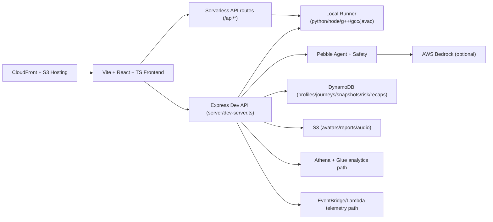

# PebbleCode

**A recovery-first coding practice platform** with a premium IDE, mentor guidance, and measurable progress analytics.

PebbleCode is built for one thing: helping learners recover faster from mistakes.  
Instead of only tracking accepted submissions, it tracks the full loop: run → diagnose → fix → rerun.

---

## Why PebbleCode

- **Recovery over rote AC:** measures how quickly and independently a learner bounces back.
- **Mentor in context:** tiered guidance (Hint / Explain / Next step) based on live session state.
- **Real language execution:** Python 3, JavaScript, C++17, Java 17, and C (GNU) support in the local runner.
- **Signals, not guesses:** autonomy, recovery time, hint usage, streak/risk, and recap surfaces.
- **Demo-safe architecture:** runs locally without AWS; scales to AWS services when configured.

---

## Judges Quickstart

### Requirements

- Node.js 18+
- npm 9+
- Local toolchains:
  - `python3`
  - `node`
  - `g++`
  - `gcc`
  - `javac` + `java` (JDK 17+)

### One-command local run

```bash
npm install
npm run dev:full
```

Open [http://localhost:5173](http://localhost:5173)

### Fast click-path

1. Home → **Try Pebble**
2. Session IDE → pick language → **Run tests**
3. Trigger fail → open **Pebble Coach**
4. Fix code → **Submit**
5. Go to **Dashboard / Insights**
6. Click **Export Report**

---

## Demo Script (2–4 minutes)

1. **Problem framing (20s)**  
   “PebbleCode optimizes recovery quality, not just final correctness.”

2. **Live coding loop (60–90s)**  
   Run a starter, show failing testcase, apply fix, rerun.

3. **Mentor interaction (45–60s)**  
   Use Hint → Explain to show controlled, contextual support.

4. **Progress evidence (30–45s)**  
   Show recovery/autonomy signals in dashboard widgets.

5. **Export artifact (20–30s)**  
   Export the one-page Recovery Report PDF.

---

## Feature Tour

### 1) Session IDE + Runtime Feedback

- Monaco editor with language switching and session memory.
- Run/submit pipeline with structured pass/fail diagnostics.
- Function-mode and stdio-mode support paths in the session engine.
- Local runner in `/server/runnerLocal.ts`:
  - Python 3
  - JavaScript
  - C++17
  - Java 17
  - C (GNU)

### 2) Pebble Coach

- Contextual mentor panel in session.
- Tiered assistance flow and guidance actions.
- Safety/policy logic in `/server/safety` and `/server/pebbleAgent/policy.ts`.
- Bedrock-backed response path when configured; local-safe fallback path otherwise.

### 3) Problems Browser + Unit Flow

- Problems list with filters and topic-driven browsing.
- Session launch from selected problem context.
- Curriculum + unit drawer integration in session.

### 4) Insights + Ops

- Dashboard cards/charts for progress and recovery indicators.
- Cohort analytics API with Athena-backed path + fallback behavior.
- Admin Ops page (`/ops`) for operational metrics.

### 5) Auth + Profiles

- Cognito-integrated login/signup/verify flows in frontend.
- Profile system with username checks, cooldown enforcement, avatar handling.
- Header identity integration (avatar + name).

### 6) Export Recovery Report

- Premium one-page dark PDF generated server-side.
- Includes user/session/problem metadata, KPI cards, error breakdown, and summary bullets.
- Download filename includes sanitized user + problem + date.

### 7) Notifications

- Header bell opens filterable notification center (All / Coach / Progress / System).
- Local persisted, user-scoped notification storage.
- Wired to key actions (run/submit/export/profile/auth hooks where implemented).

---

## Architecture Overview



### Runtime modes

- **Local-first:** `npm run dev:full` (frontend + dev API + local runner).
- **AWS-enhanced:** optional services enabled by env + IAM.
- **Hybrid API:** `/api/run` supports local/remote URL/Lambda runner strategies.

---

## Tech Stack

| Layer | Technologies |
|---|---|
| Frontend | React 19, TypeScript, Vite, Tailwind, Framer Motion, Monaco |
| Local API | Express 5 + TypeScript |
| Serverless API | Vercel handlers in `/api` |
| Runner | python3, node, g++, gcc, javac/java |
| AI | AWS Bedrock Runtime |
| Data | DynamoDB, EventBridge, Athena, Glue |
| Files | S3 + signed URL workflows |
| Infra | AWS CDK v2 multi-stack setup |

---

## Setup

## Local Setup

1. Install deps:

```bash
npm install
```

2. Create local env:

```bash
cp .env.example .env.local
```

3. Start frontend + backend:

```bash
npm run dev:full
```

4. Verify:

- Frontend: [http://localhost:5173](http://localhost:5173)
- Health API: [http://localhost:3001/api/health](http://localhost:3001/api/health)

### Validation commands

```bash
npm run lint
npm run typecheck
npm run build
npm run smoke
npm run smoke:runner-modes
npm run self-check:language-pipeline
npm run test:function-mode
```

## Environment Variables

Use `.env.local` (see `.env.example` for canonical values/comments).

| Variable | Required | Purpose |
|---|---|---|
| `AWS_REGION` | Recommended | Region for AWS SDK clients |
| `FRONTEND_ORIGIN` | Recommended | Link origins for share/report URLs |
| `VITE_COGNITO_USER_POOL_ID` | Auth UI | Cognito user pool id |
| `VITE_COGNITO_CLIENT_ID` | Auth UI | Cognito app client id |
| `COGNITO_USER_POOL_ID`, `COGNITO_CLIENT_ID` | Optional fallback | Non-`VITE_` fallback env keys |
| `PROFILES_TABLE_NAME` | Profile persistence | DynamoDB profile table |
| `AVATARS_BUCKET_NAME` | Avatar uploads | S3 bucket for avatars |
| `REPORTS_BUCKET_NAME` | Report storage path | S3 bucket for reports |
| `BEDROCK_MODEL_ID` | AI mode | Bedrock model id |
| `BEDROCK_GUARDRAIL_ID`, `BEDROCK_GUARDRAIL_VERSION` | Optional | Guardrail integration |
| `RUNNER_URL` | Remote runner mode | External runner endpoint |
| `RUNNER_LAMBDA_NAME` | Lambda runner mode | Lambda function for run API |
| `SAFETY_MODE` | Optional | `auto` / `strict` / `off` |
| `SAGEMAKER_*`, `RISK_*`, `WEEKLY_RECAPS_*`, `POLLY_*` | Optional | Premium phase services |
| `INGEST_EVENTS_LAMBDA_NAME`, analytics vars | Optional | Event + analytics integrations |

## AWS Setup (CDK)

From repo root:

1. Install infra dependencies:

```bash
cd infra
npm ci
```

2. Bootstrap account/region (one-time):

```bash
npx cdk bootstrap aws://<ACCOUNT_ID>/<REGION>
```

3. Deploy stacks:

```bash
npx cdk deploy --all
```

4. Deploy frontend to S3 + CloudFront:

```bash
cd ..
bash infra/scripts/deploy-frontend.sh
```

Optional overrides:

```bash
AWS_REGION=ap-south-1 AWS_PROFILE=<profile> STACK_NAME=PebbleHostingStack bash infra/scripts/deploy-frontend.sh
```

---

## Deploy to AWS (CloudFront + S3)

This repo already includes deploy tooling in `infra/scripts/deploy-frontend.sh`.

What it does:
1. Builds frontend (`npm ci && npm run build`)
2. Resolves stack outputs (`S3BucketName`, `CloudFrontDistributionId`)
3. Syncs `dist/` to S3 with cache headers
4. Creates CloudFront invalidation (`/*`)

---

## Project Structure

```text
.
├── src/
│   ├── pages/                 # Landing, Session, Problems, Dashboard, Profile, Auth, Legal
│   ├── components/            # home/session/layout/ui/insights/auth
│   ├── providers/             # Auth, Theme, I18n providers
│   ├── data/                  # problem bank + onboarding/curriculum data
│   ├── lib/                   # auth, runner client, storage, language/mode helpers
│   └── i18n/                  # language packs + localized copy
├── server/
│   ├── dev-server.ts          # Local API surface for app features
│   ├── runnerLocal.ts         # Local compile/run execution engine
│   ├── reports/               # report model + PDF renderer
│   ├── pebbleAgent/           # mentor orchestration
│   └── safety/                # redaction + policy checks
├── api/                       # serverless API handlers
├── shared/                    # shared language registry and types
├── scripts/                   # smoke checks + pipeline self-checks
├── infra/                     # CDK stacks + lambda + deploy scripts
└── docs/                      # operational notes
```

---

## Safety, Privacy, and Guardrails

- Safety filters and policy checks are applied before coach responses are returned.
- Guidance tiers are designed to reduce direct solution leakage in lower tiers.
- Auth-gated profile/report flows use bearer-token identity checks.
- Local persisted data uses scoped keys (`pebble.*`) with user namespacing where available.
- Reports are metadata-oriented and avoid raw secret dumping by design.

---

## Troubleshooting

### Cognito not configured
- Set:
  - `VITE_COGNITO_USER_POOL_ID`
  - `VITE_COGNITO_CLIENT_ID`
- Restart/redeploy after env updates.

### `/api/run` failing
- Local mode: ensure `npm run dev:full` is running.
- Remote mode: set `RUNNER_URL`.
- Lambda mode: set `AWS_REGION` + `RUNNER_LAMBDA_NAME`.

### Missing language toolchain
Install and expose in PATH:
- `python3`, `node`, `g++`, `gcc`, `javac`, `java`.

### Bedrock path not responding
- Verify AWS creds, region, and `BEDROCK_MODEL_ID`.
- Without valid Bedrock config, fallback path is expected.

### Avatar uploads failing
- Set `AVATARS_BUCKET_NAME`.
- Ensure S3 bucket CORS allows frontend origin.

### Verify/resend signup behavior in deployed environments
- Local dev server includes `/api/auth/confirm-signup` and `/api/auth/resend-signup-code`.
- If deployed API returns HTML or route misses, verify API Gateway route wiring and redeploy backend stack.

### Vercel run route diagnostics
- See `/docs/vercel-run-debug.md`.

---

## Screenshots / GIFs

If you’re preparing a submission deck, add images under:

`/docs/screenshots`

Recommended captures:
1. `home-hero-dark.png`
2. `session-run-fail-fix.png`
3. `coach-tiered-guidance.png`
4. `problems-browser-filters.png`
5. `insights-dashboard.png`
6. `recovery-report-pdf.png`

---

## Roadmap / What’s Next

Near-term (based on current code + scripts):
- Expand language parity checks across all unit/problem modes.
- Grow curated problem packs and editorials with richer hidden tests.
- Improve deployment ergonomics and environment bootstrap flow.
- Harden premium phase services (risk + weekly recap) for production consistency.

Historical roadmap context remains in `/ROADMAP.md`.

---

## Credits

Built by the PebbleCode team.

## License

No explicit OSS license file is currently present in this repository.
