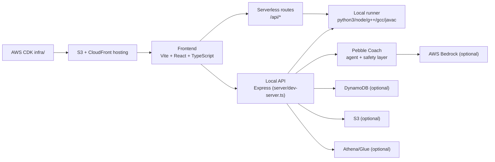

# PebbleCode

**Recovery-first coding practice: write code, run it, recover from failures faster, and measure progress.**

## In one sentence
PebbleCode is a premium coding practice app where the core loop is not just “Accepted”, but **run → diagnose → fix → rerun** with contextual mentor guidance and measurable recovery analytics.

## What makes PebbleCode different
- **Recovery is the primary metric**: the product tracks autonomy, hint reliance, recovery speed, and error patterns.
- **Coach is context-aware**: hints and explain/next-step modes are grounded in the current session state and run outcome.
- **Track + flexibility**: placement sets learning pace and recommendations, while editor language remains user-selectable.

| Typical coding platforms | PebbleCode |
|---|---|
| Optimize for final AC only | Optimizes for recovery quality across attempts |
| Language choice and learner model often coupled | Learning track and editor language are separated |
| Generic hints | Tiered mentor guidance tied to live run context |

## Proof it works
- Local runner executes **Python 3, JavaScript, C++17, Java 17, and C (GNU)** with toolchain probing and timeouts.
- Session IDE supports language switching, run/submit flow, and per-language draft persistence.
- Auth supports signup, verify-email, login, forgot password, and profile hydration.
- Notifications center is live in header, scoped per user, and persisted in localStorage.
- Recovery report export generates a downloadable, single-page PDF with user/problem/session metadata.

## Judges Quickstart
### Requirements
- Node.js 18+
- npm 9+
- Optional for full multi-language execution: `python3`, `node`, `g++`, `gcc`, `javac` + `java`

### Fast start
```bash
npm install
npm run dev:full
```

Open [http://localhost:5173](http://localhost:5173)

### 3-minute click path
1. Home → **Try Pebble**
2. Onboarding + Placement
3. Session (`/session/1`) → switch language → **Run**
4. Open Pebble Coach (**Hint / Explain / Next step**)
5. **Submit** and inspect tests/output
6. **Export Report**
7. Dashboard/Insights for recovery metrics

## Demo Script (2–3 minutes)
- **00:00–00:20**: Problem statement and “why recovery > raw acceptance”.
- **00:20–01:10**: Run code in Session IDE, show failing tests and diagnostics.
- **01:10–01:45**: Use Coach tiers (Hint/Explain/Next step) to recover.
- **01:45–02:15**: Submit again, show improved outcome.
- **02:15–02:40**: Export recovery report PDF.
- **02:40–03:00**: Open Dashboard and highlight autonomy + streak + issue profile.

## Feature Tour
### 1) Session IDE + Runner
- Monaco-based editor with language-aware boilerplates and mode handling.
- Run API supports compile/runtime/timeout/toolchain-unavailable statuses.
- Function-mode and stdio-mode support exists in the local runner pipeline.

### 2) Pebble Coach
- Right-panel mentor with tiered response modes.
- Uses session context and run-state signals.
- Safety/policy middleware is present server-side.

### 3) Problems Browser
- LeetCode-style listing with filters and sorting.
- Integrated with solved-state and session entry points.

### 4) Placement + Learning Track
- Onboarding and placement define track language focus + level.
- Track informs recommendations/pacing, not editor lock-in.

### 5) Insights Dashboard
- Recovery/autonomy/hint/streak-oriented metrics and widgets.
- Includes issue-profile views and progression surfaces.

### 6) Notifications Center
- Header bell with unread state and category filters.
- Mark-all, clear, item actions, and per-user local persistence.

### 7) Auth + Profile
- Cognito-backed auth flows with verification screen.
- Profile includes avatar, display name, username flow, and bio.

### 8) Recovery Report Export
- Server-side PDF generation (`pdfkit`) with premium dark report layout.
- Includes user identity, problem/session metadata, KPIs, and summary bullets.

## Architecture Overview
PebbleCode is a Vite React frontend with a local Express API layer for runner/auth/report flows, plus optional AWS integrations for cloud-backed capabilities.



## Setup
### Local setup
```bash
npm install
cp .env.example .env.local
npm run dev:full
```

Frontend: [http://localhost:5173](http://localhost:5173)  
Backend health: [http://localhost:3001/api/health](http://localhost:3001/api/health)

### Useful validation commands
```bash
npm run typecheck
npm run build
npm run smoke
npm run smoke:runner-modes
npm run self-check:language-pipeline
npm run test:function-mode
```

### Environment variables (core)
| Variable | Required | Purpose |
|---|---|---|
| `AWS_REGION` | Optional (required for many AWS-backed flows) | AWS SDK region |
| `FRONTEND_ORIGIN` | Recommended | Share/report links origin |
| `VITE_API_BASE_URL` | Recommended for Amplify/Vite static hosting | Absolute backend origin, e.g. `https://<api-id>.execute-api.<region>.amazonaws.com` |
| `VITE_COGNITO_USER_POOL_ID` | Auth | Cognito User Pool ID |
| `VITE_COGNITO_CLIENT_ID` | Auth | Cognito App Client ID |
| `COGNITO_USER_POOL_ID`, `COGNITO_CLIENT_ID` | Optional fallback | Non-`VITE_` frontend fallback keys |
| `PROFILES_TABLE_NAME` | Optional | Profiles table for backend/profile APIs |
| `AVATARS_BUCKET_NAME` | Optional | Persistent avatar uploads |
| `BEDROCK_MODEL_ID` | Optional | Coach model selection |
| `RUNNER_URL` | Optional | Remote runner endpoint |
| `RUNNER_LAMBDA_NAME` | Optional | Lambda-based runner target |

### AWS setup (optional)
```bash
cd infra
npm ci
npx cdk bootstrap aws://<ACCOUNT_ID>/<REGION>
npx cdk deploy --all
```

## Deploy to CloudFront + S3
This repo includes an automated frontend deploy script:

```bash
AWS_REGION=ap-south-1 AWS_PROFILE=<your-profile> STACK_NAME=PebbleHostingStack bash infra/scripts/deploy-frontend.sh
```

What it does:
1. Builds frontend (`npm ci && npm run build`)
2. Resolves S3 bucket + CloudFront distribution from stack outputs
3. Syncs `dist/` to S3 with cache headers
4. Creates CloudFront invalidation

## Deploy frontend on Amplify Hosting
If you host the Vite frontend on Amplify instead of CloudFront, set these Amplify environment variables on the branch before building:

- `VITE_API_BASE_URL=https://<api-id>.execute-api.<region>.amazonaws.com`
- `VITE_COGNITO_USER_POOL_ID=<stack output UserPoolId>`
- `VITE_COGNITO_CLIENT_ID=<stack output UserPoolClientId>`

The app uses relative `/api/*` paths by default. `VITE_API_BASE_URL` is what lets a static Amplify-hosted frontend talk to the CDK-deployed API Gateway backend directly.

## Safety / Privacy / Boundaries
- Safety policy layer is applied before final mentor output is returned.
- Notifications are stored in localStorage with per-user scoping.
- Profile/avatar/report routes rely on authenticated identity when token is available.
- Exported report filename is sanitized to avoid unsafe characters.
- Runtime execution is timeout-bounded and output-truncated.
- Sensitive cloud features are optional and gated by env configuration.

## Known limitations (today)
1. `npm run lint` currently reports many pre-existing issues; build and typecheck pass.
2. Report generation route currently uses a mocked event slice for KPI composition in local flow.
3. Some AWS-enhanced paths (Bedrock/Athena/S3 variants) are configuration-dependent and should be treated as optional in fresh local setups.

## Next improvements
- Tighten lint baseline and enforce CI lint gate.
- Replace mocked report events with full event-rollup data path by default.
- Expand curated problem coverage and hidden-test depth.

## Troubleshooting
- **“Cognito not configured”**: set `VITE_COGNITO_USER_POOL_ID` and `VITE_COGNITO_CLIENT_ID`, then restart/redeploy.
- **Run API failures**: ensure `npm run dev:full` is running; otherwise configure `RUNNER_URL` or `AWS_REGION + RUNNER_LAMBDA_NAME`.
- **Toolchain unavailable**: install missing executables (`python3`, `node`, `g++`, `gcc`, `javac`, `java`).
- **Bedrock errors**: verify AWS credentials, `AWS_REGION`, and `BEDROCK_MODEL_ID`.
- **Avatar persistence issues**: configure `AVATARS_BUCKET_NAME` and bucket CORS for your frontend origin.

## Screenshots checklist for submission
If you are preparing a demo submission, capture:
1. Landing hero + value proposition
2. Session IDE with failing run and recovery
3. Pebble Coach tier switch (Hint/Explain/Next step)
4. Problems browser with filters
5. Dashboard insights widgets
6. Exported Recovery Report PDF

(Current repo has docs but no committed screenshot set. Suggested folder: `docs/screenshots/`.)

## Credits
Built by **Addy (Aditya Singh)**.

## License
No explicit OSS license file is currently present in this repository.
