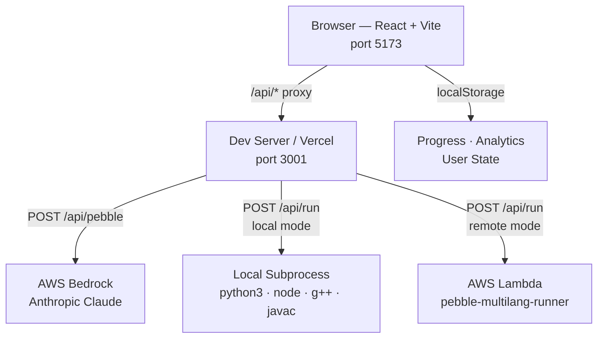

# Pebble — AI Learning Companion for Developers

> Hackathon submission: **AI for Bharat** · Built for Indian developers learning to code

---

## TL;DR

Pebble is a browser-based AI learning companion. It watches how you code — edits, errors, time stuck, run failures — and uses a real-time **struggle detection engine** to decide when to step in. When it does, it calls **AWS Bedrock (Anthropic Claude)** server-side and delivers a short, actionable coaching nudge.

Runs real code (Python, JavaScript, C++, Java, C). Supports **13 Indian languages**. No signup required.

```
npm install && npm run dev:full
# → open http://localhost:5173
```

---

## Why Pebble

Most coding platforms give hints on a timer or on explicit "ask for help" clicks. Pebble does neither.

**The problem:** A developer stuck for 8 minutes silently re-typing the same wrong line gets no help. A developer who just solved something gets unhelpful, premature hints.

**Pebble's approach:**
1. **Behavioral struggle detection** — tracks edit churn ratio, deletion bursts, time-without-progress, run-fail streaks, and same-error repetition. Quantified as a continuous 0–100 score across 4 severity levels.
2. **Contextual AI coaching** — sends compact context (code, error history, struggle score, guided state) to Bedrock. Response cap: 6 lines, max 240 tokens. Calm. Terse. Action-first.
3. **Bharat-first i18n** — problem statements, hints, and UI in 13 Indian languages including Hindi, Bengali, Tamil, and Urdu (RTL layout).
4. **Real code execution** — no sandboxed pseudo-runners. Spawns real language runtimes locally or via AWS Lambda.
5. **Zero friction** — no account, no login. State lives in localStorage. Open the app, start coding.

---

## What's Working in This Prototype

### Implemented ✅

| Feature | Location |
|---|---|
| Landing page | `src/pages/LandingPage.tsx` |
| Onboarding (language + level selection) | `src/pages/OnboardingPage.tsx` |
| Placement test (4 MCQ + 3 coding, weekly rotation) | `src/pages/PlacementPage.tsx` |
| Session page: Monaco editor + problem statement + Pebble chat | `src/pages/SessionPage.tsx` |
| Problems list with filter, search, topic tags | `src/pages/ProblemsPage.tsx` |
| Dashboard: streak, heatmap, radar chart, KPIs | `src/pages/DashboardPage.tsx` |
| Struggle detection engine (4 levels, 6 behavioral signals) | `src/lib/struggleEngine.ts` |
| Pebble AI coaching via AWS Bedrock Anthropic | `api/pebble.ts` |
| Code runner: Python, JavaScript, C++, Java (local subprocess) | `api/run/runnerLocal.ts` |
| Code runner: C language | `src/content/paths/c.json` (curriculum), `api/run/` |
| AWS Lambda code runner (remote mode) | `runner/container/` |
| 13-language i18n (problem copy + UI strings) | `src/i18n/` |
| RTL layout support for Urdu | `src/i18n/languages.ts` |
| Curriculum paths: Python, JS, C++, Java, C (JSON units) | `src/content/paths/` |
| Unit progress + submission history (localStorage) | `src/lib/progressStore.ts`, `submissionsStore.ts` |
| Stopwatch per session | `src/lib/stopwatchStore.ts` |
| Analytics events: run, submit, assist, solve | `src/lib/analyticsStore.ts` |
| Current + longest streak, daily heatmap (real data) | `src/lib/analyticsDerivers.ts` |
| Pebble context compaction (server-side, cost-controlled) | `api/pebble.ts` |
| Cancellation + single-flight LLM requests | `src/utils/pebbleLLM.ts` |
| Vercel serverless deployment config | `vercel.json`, `api/` |
| Health check endpoint | `api/health.ts` |

### Partially Implemented 🟡

| Feature | Status | Location |
|---|---|---|
| Dashboard insight charts | Streak/heatmap are real; radar, growth ledger, issue bars use mock data | `src/data/mockInsights.ts` |
| Daily learning plan | Interface defined, returns mock data with 1.5s simulated delay | `src/api/plan.ts` |
| Problems bank (solo practice) | Bank defined + UI renders; not yet linked to session flow | `src/data/problemsBank.ts` |

### Planned / Not Implemented 🔴

- User authentication and cloud persistence (all state is localStorage only)
- SQL track (schema + runtime defined, no execution backend)
- Adaptive personalization by learner history (ROADMAP Phase 8)
- Backend analytics aggregation

---

## Live Demo (if applicable)

If a deployment URL is provided by the team, open it and navigate to:

- `/` — Landing
- `/onboarding` — Choose language + level
- `/placement` — Take placement test
- `/session/1` — Start coding with Pebble
- `/dashboard` — View progress

To run locally, see [Getting Started](#getting-started-local).

---

## Key Features

### Struggle Engine
`src/lib/struggleEngine.ts` — 405 lines of behavioral scoring logic.

- **Score 0–100** computed continuously from a 90-second rolling window of events
- **Level 0** — no intervention
- **Level 1** — gentle nudge (score ≥ 35 for 10s, or stuck ≥ 45s)
- **Level 2** — stronger nudge (score ≥ 60 or 3+ run failures)
- **Level 3** — escalated coaching (score ≥ 85 or 5+ failures after guidance)
- Hysteresis: levels go up fast, down slow (12s hold), with cooldown after each nudge
- Passed to Pebble's prompt as `struggleScore` and `repeatErrorCount`

### Monaco Code Editor
Full VS Code-grade editor via `@monaco-editor/react`. Syntax highlighting, multi-language support, theme-aware.

### Multi-Language i18n
13 languages with dedicated JSON files in `src/i18n/problemCopy/`:

`en` · `hi` (Hindi) · `bn` (Bengali) · `te` (Telugu) · `mr` (Marathi) · `ta` (Tamil) · `ur` (Urdu, RTL) · `gu` (Gujarati) · `kn` (Kannada) · `ml` (Malayalam) · `or` (Odia) · `pa` (Punjabi) · `as` (Assamese)

Language preference persisted in `localStorage` (`pebble.chatLanguage.v1`). RTL layout applied automatically for Urdu.

### Placement Test
`src/pages/PlacementPage.tsx` — 7 questions per attempt: 4 MCQ + 3 live coding. Weekly rotation using deterministic seeding: `(language + level + week-bucket)`. Same profile sees the same set for the week. Result sets starting unit in the curriculum.

### Curriculum System
5 language tracks (Python, JavaScript, C++, Java, C), each with ordered units. Every unit has:
- Problem statement + concept
- Starter code template
- Test cases (input → expected)
- Hints array
- Per-language localized content fields

### Analytics Dashboard
`src/pages/DashboardPage.tsx` — Includes KPI cards, hex radar (6 axes: speed, accuracy, consistency, autonomy, debugging, complexity), streak calendar, contribution heatmap, and next-task recommendations.

---

## Architecture

```
┌─────────────────────────────────────────────────────┐
│                  Browser (React + Vite)              │
│  port 5173                                          │
│                                                     │
│  / → LandingPage                                    │
│  /onboarding → OnboardingPage                       │
│  /placement  → PlacementPage  (4 MCQ + 3 coding)   │
│  /session/:id → SessionPage  (Monaco + Pebble)     │
│  /problems   → ProblemsPage                         │
│  /dashboard  → DashboardPage (analytics)            │
│                                                     │
│  localStorage: progress, analytics, user state      │
└──────────────┬──────────────────────────────────────┘
               │  /api/* (proxy in dev)
               ▼
┌─────────────────────────────────────────────────────┐
│  Express Dev Server  (server/dev-server.ts)          │
│  port 3001                                          │
│  [Vercel serverless in production: api/]            │
│                                                     │
│  POST /api/pebble ──────────────────────────────┐  │
│  POST /api/run   ──────┐                        │  │
│  GET  /api/health      │                        │  │
└────────────────────────┼────────────────────────┼──┘
                         │                        │
          ┌──────────────┴──────────┐      ┌──────┴──────────────┐
          │  PEBBLE_RUNNER_MODE     │      │  AWS Bedrock         │
          │  local (default)        │      │  Anthropic Claude    │
          │  → spawn python3/node   │      │  max_tokens: 240     │
          │    g++/javac/java       │      │  temperature: 0.35   │
          │                         │      └─────────────────────┘
          │  remote                 │
          │  → AWS Lambda           │
          │    pebble-multilang-    │
          │    runner (Docker)      │
          └─────────────────────────┘
```

**Mermaid (paste into any Mermaid renderer):**



---

## Tech Stack

| Layer | Technology |
|---|---|
| Frontend framework | React 19.2 + Vite 7.3 |
| Routing | React Router 7.13 |
| Code editor | Monaco Editor 0.55 (`@monaco-editor/react`) |
| Styling | Tailwind CSS 3.4 + PostCSS |
| Icons | lucide-react |
| UI primitives | Radix UI (tooltips), react-day-picker |
| Dev server | Express 5.2 |
| Language | TypeScript 5.9 |
| AI / LLM | AWS Bedrock (`@aws-sdk/client-bedrock-runtime`) |
| Lambda runner | AWS Lambda (`@aws-sdk/client-lambda`) |
| Lambda infra | AWS SAM (CloudFormation) |
| Deployment | Vercel (serverless functions via `api/` directory) |
| State | Browser localStorage (no backend DB) |

---

## Repository Structure

```
pebble-prototype-dev/
│
├── api/                          # Vercel serverless functions
│   ├── _shared/
│   │   └── pebblePromptRules.js  # Shared LLM system prompt + tone rules
│   ├── health.ts                 # GET /api/health — env check
│   ├── pebble.ts                 # POST /api/pebble — AWS Bedrock AI coaching
│   └── run/
│       ├── index.ts              # POST /api/run — entry point + routing
│       ├── runnerLocal.ts        # Local subprocess runner (spawn)
│       └── runnerShared.ts       # Shared types + request validation
│
├── runner/                       # AWS Lambda runner deployment
│   ├── handler.py                # Python-only Lambda function
│   ├── template.yaml             # SAM template (Python only, arm64)
│   ├── samconfig.toml
│   └── container/                # Multi-language Lambda (Docker)
│       ├── handler.py
│       ├── Dockerfile
│       └── template.yaml         # SAM template (x86_64, 1GB)
│
├── server/                       # Local Express dev server
│   ├── dev-server.ts             # Entry: loads .env.local, routes /api/*
│   ├── runner.ts
│   ├── runnerLocal.ts            # Local subprocess runner (dev mirror)
│   └── runnerShared.ts
│
├── shared/
│   └── pebblePromptRules.ts      # TypeScript mirror of prompt rules
│
├── src/
│   ├── App.tsx                   # Route definitions
│   ├── api/
│   │   └── plan.ts               # Daily plan interface (mock, 🟡)
│   ├── components/
│   │   ├── insights/             # Dashboard chart components
│   │   ├── mascot/               # PebbleMascot chat UI
│   │   ├── placement/            # MCQ + coding question cards
│   │   ├── problems/             # Problems table + filter
│   │   ├── session/              # CodeEditor, PebbleChatPanel, TestResultsPanel, etc.
│   │   └── ui/                   # Design system primitives
│   ├── content/
│   │   ├── pathLoader.ts         # Fetch + cache + validate curriculum JSON
│   │   └── paths/                # Curriculum units per language
│   │       ├── python.json
│   │       ├── javascript.json
│   │       ├── cpp.json
│   │       ├── java.json
│   │       └── c.json
│   ├── data/
│   │   ├── onboardingData.ts     # Language + level metadata, scoreToStartUnit
│   │   ├── placementBank.ts      # MCQ + coding placement questions
│   │   ├── problemsBank.ts       # Standalone problems bank
│   │   ├── solutionsBank.ts      # Reference solutions
│   │   ├── mockInsights.ts       # Static mock data for some charts (🟡)
│   │   └── functionModeTemplates.ts
│   ├── i18n/
│   │   ├── languages.ts          # 13 language definitions + RTL flag
│   │   ├── I18nProvider.tsx      # Context provider
│   │   ├── useI18n.ts            # Hook: t(), lang, isRTL
│   │   ├── strings.ts            # UI string keys
│   │   └── problemCopy/          # Per-language JSON (en hi bn te mr ta ur gu kn ml or pa as)
│   ├── lib/
│   │   ├── struggleEngine.ts     # Behavioral struggle detection (core)
│   │   ├── analyticsStore.ts     # Event logging + external store
│   │   ├── analyticsDerivers.ts  # Streak, heatmap, insights derivation
│   │   ├── progressStore.ts      # Unit completion (localStorage)
│   │   ├── submissionsStore.ts   # Submission history (localStorage)
│   │   ├── runApi.ts             # Client wrapper for POST /api/run
│   │   └── functionMode.ts       # Test harness builder + signature validation
│   ├── pages/
│   │   ├── LandingPage.tsx
│   │   ├── OnboardingPage.tsx
│   │   ├── PlacementPage.tsx
│   │   ├── SessionPage.tsx
│   │   ├── ProblemsPage.tsx
│   │   └── DashboardPage.tsx
│   └── utils/
│       ├── pebbleLLM.ts          # askPebble() client: safe mode + unsafe_client mode
│       ├── pebbleUserState.ts    # Read/write pebbleUserState localStorage key
│       └── pebbleMemory.ts       # Conversation memory (last 6 turns)
│
├── docs/
│   └── vercel-run-debug.md       # Vercel runner debugging notes
├── scripts/
│   └── devRunnerSmoke.ts         # Local smoke test script
├── vercel.json                   # Vercel routes + serverless function config
├── vite.config.ts                # Vite: React plugin, /api proxy → :3001
├── package.json
├── AUDIT.md                      # E2E audit: LLM flow, cancellation, security
└── ROADMAP.md                    # Phase-by-phase development plan
```

---

## Getting Started (Local)

### Prerequisites

| Tool | Version | Check |
|---|---|---|
| Node.js + npm | 18+ | `node -v` |
| Python 3 | 3.9+ | `python3 --version` |
| g++ | any recent | `g++ --version` |
| JDK | 17+ | `javac -version` |

Python, g++, and JDK are only required if you want to run those languages locally. The app still launches without them — you'll get a runner error only when executing that language.

### Install

```bash
git clone https://github.com/addyvantage/pebble-prototype-dev.git
cd pebble-prototype-dev
npm install
```

### Configure environment

Create `.env.local` in the project root:

```env
# Required: AWS Bedrock for AI coaching
AWS_REGION=ap-south-1
BEDROCK_MODEL_ID=anthropic.claude-sonnet-4-5-20250929-v1:0

# Optional: explicit AWS credentials (or use IAM role / default credential chain)
# AWS_ACCESS_KEY_ID=AKIA...
# AWS_SECRET_ACCESS_KEY=...

# Code runner mode (default: local)
PEBBLE_RUNNER_MODE=local
```

### Run

```bash
npm run dev:full
```

This starts:
- **Frontend** (Vite) on `http://localhost:5173`
- **Backend** (Express) on `http://localhost:3001`

Vite proxies all `/api/*` requests to the Express server.

Then open: **`http://localhost:5173`**

Suggested first-run path: `/onboarding` → `/placement` → `/session/1`

---

## Environment Variables

### Server-side (`server/dev-server.ts` · `api/`)

| Variable | Required | Default | Purpose |
|---|---|---|---|
| `AWS_REGION` | ✅ | — | Region for Bedrock + Lambda |
| `BEDROCK_MODEL_ID` | ✅ | — | Bedrock model ID (must end in `:v1:0`) |
| `AWS_ACCESS_KEY_ID` | optional | — | Explicit AWS creds (both or neither) |
| `AWS_SECRET_ACCESS_KEY` | optional | — | Explicit AWS creds (both or neither) |
| `PEBBLE_RUNNER_MODE` | optional | `local` | `local` or `remote` |
| `RUNNER_LAMBDA_NAME` | if remote | — | Lambda function name or ARN |
| `RUNNER_URL` | if remote | — | HTTP endpoint alternative to Lambda |
| `PORT` | optional | `3001` | Express dev server port |
| `PEBBLE_DEBUG_ERRORS` | optional | — | Set to `1` for verbose error responses |
| `PEBBLE_DEBUG_COST` | optional | — | Set to `1` to log token size estimates |

### Client-side (`VITE_` prefix, never use for secrets)

| Variable | Required | Default | Purpose |
|---|---|---|---|
| `VITE_PEBBLE_LLM_MODE` | optional | `server` | Set to `unsafe_client` to call OpenAI directly from browser (demo only — exposes key) |
| `VITE_OPENAI_API_KEY` | if unsafe | — | OpenAI API key (only for `unsafe_client` mode) |
| `VITE_OPENAI_MODEL` | optional | — | OpenAI model (e.g., `gpt-4o`) |

> **Note:** Never put AWS credentials in `VITE_` variables. Bedrock auth is server-side only.

---

## Running the App

| Command | Description |
|---|---|
| `npm run dev` | Frontend only (Vite, port 5173) |
| `npm run dev:frontend` | Alias for `npm run dev` |
| `npm run dev:backend` | Backend only (Express, port 3001) |
| `npm run dev:full` | Both concurrently (recommended) |
| `npm run build` | TypeScript check + Vite production build |
| `npm run lint` | ESLint check |
| `npm run preview` | Preview production build locally |

---

## How the Code Runner Works

### Request

`POST /api/run` — accepts JSON:

```json
{
  "language": "python",
  "code": "print(2 + 2)",
  "stdin": "",
  "timeoutMs": 4000
}
```

Supported `language` values: `python` · `javascript` · `cpp` · `java`

### Response

```json
{
  "ok": true,
  "exitCode": 0,
  "stdout": "4\n",
  "stderr": "",
  "timedOut": false,
  "durationMs": 18
}
```

### Execution limits

| Limit | Value |
|---|---|
| Default timeout | 4,000 ms |
| Max timeout | 6,000 ms |
| Code size | 50,000 chars |
| stdout/stderr each | 16,000 chars |
| Temp dir | `.pebble_tmp/<runId>/` (auto-cleaned) |

### Local mode (`PEBBLE_RUNNER_MODE=local`)

Spawns real processes per language:

| Language | Compile step | Run step |
|---|---|---|
| Python | — | `python3 main.py` |
| JavaScript | — | `node main.js` |
| C++ | `g++ -std=c++17 -O2 -o main main.cpp` | `./main` |
| Java | `javac Main.java` | `java -cp . Main` |

Each run gets an isolated temp directory. SIGKILL enforced on timeout.

### Remote mode (`PEBBLE_RUNNER_MODE=remote`)

Invokes AWS Lambda via `LambdaClient.InvokeCommand`. Set:

```env
PEBBLE_RUNNER_MODE=remote
AWS_REGION=ap-south-1
RUNNER_LAMBDA_NAME=pebble-multilang-runner
```

### Smoke tests

```bash
# Python
curl -sS -X POST http://localhost:5173/api/run \
  -H "Content-Type: application/json" \
  -d '{"language":"python","code":"print(40+2)","stdin":"","timeoutMs":4000}'

# JavaScript
curl -sS -X POST http://localhost:5173/api/run \
  -H "Content-Type: application/json" \
  -d '{"language":"javascript","code":"console.log(40+2)","stdin":"","timeoutMs":4000}'

# C++
curl -sS -X POST http://localhost:5173/api/run \
  -H "Content-Type: application/json" \
  -d '{"language":"cpp","code":"#include <iostream>\nint main(){std::cout<<42<<std::endl;}","stdin":"","timeoutMs":5000}'

# Java
curl -sS -X POST http://localhost:5173/api/run \
  -H "Content-Type: application/json" \
  -d '{"language":"java","code":"public class Main{public static void main(String[] a){System.out.println(42);}}","stdin":"","timeoutMs":6000}'
```

---

## How "Ask Pebble" Works (LLM)

### Default (safe) mode — server-side Bedrock

```
Browser
  └─ PebbleChatPanel.tsx (user types question)
       └─ pebbleLLM.ts: askPebble()
            └─ POST /api/pebble  { prompt, context }
                 └─ api/pebble.ts
                      ├─ compactContextForModel()  — trims code/errors
                      ├─ buildPebblePrompt()        — user message assembly
                      └─ BedrockRuntimeClient.InvokeModelCommand
                           └─ Returns { text: "..." }
```

### Context sent to Bedrock

```typescript
{
  taskTitle: string         // current problem
  codeText: string          // trimmed to 1800 chars
  runStatus: string         // 'ok' | 'error' | 'timeout' | ...
  runMessage: string        // trimmed to 360 chars
  language: string
  struggleScore: number     // 0–100 from struggle engine
  repeatErrorCount: number
  errorHistory: string[]    // last 3 errors
  guidedStep?: { current, total }
  guidedActive: boolean
  nudgeVisible: boolean
}
```

### Generation settings

| Setting | Value | Reason |
|---|---|---|
| `max_tokens` | 240 | ≤ 6 lines; controls cost per call |
| `temperature` | 0.35 | Low variance, consistent guidance |
| Memory | Last 6 turns | Bounded context, avoids runaway cost |

### Prompt personality

Defined in `api/_shared/pebblePromptRules.js` (shared source of truth):
- Calm, terse, action-first
- Under high struggle: ask one clarifying question only
- In guided mode: explain only the current step
- On success: reinforce + one micro next-step
- Hard cap: 6 lines, no fluff

### Unsafe demo mode (optional)

Set `VITE_PEBBLE_LLM_MODE=unsafe_client` + `VITE_OPENAI_API_KEY=sk-...` to call OpenAI directly from the browser. Use only for offline demos where exposing an API key is acceptable.

### Cancellation

Every submit creates a new `AbortController` and kills any in-flight request. A request-id guard blocks stale responses from overwriting newer state.

---

## Curriculum / Problems System

### Curriculum paths

Five JSON files at `src/content/paths/{language}.json`. Each file has a `units` array:

```json
{
  "units": [
    {
      "id": "hello-world",
      "title": "Hello Pebble",
      "concept": "stdout basics",
      "prompt": "Return exactly: Hello, Pebble!",
      "starterCode": "class Solution:\n    pass\n",
      "tests": [
        { "input": "", "expected": "Hello, Pebble!" }
      ],
      "hints": [],
      "localized": {
        "hi": { "title": "...", "prompt": "..." }
      }
    }
  ]
}
```

Units progress from basics (I/O, variables) through DSA (two-sum, sliding window, DP).

### How sessions load curriculum

`src/content/pathLoader.ts` fetches and caches the JSON at runtime, validates each unit, and returns typed `CurriculumUnit[]`. The session page selects a unit by index (set by placement result or manual navigation).

### Placement → starting unit

| Placement score | Starting point |
|---|---|
| 0–3 | Unit 1 (beginning) |
| 4–7 | Mid-path |
| 8–10 | Advanced units |

### Problems bank

`src/data/problemsBank.ts` defines a separate standalone problems set browsable from `/problems`. Supports filtering by difficulty (Easy / Medium / Hard), language, and topic tags.

### User progress

Persisted per unit in localStorage:
- `pebbleUserState` — selected language, level, current unit, completed unit IDs, recent chat summary
- Per-unit progress: code draft, test results, submission timestamps

---

## Testing

There is no automated test suite in this prototype. Manual verification procedures:

### Runner check

```bash
npm run dev:full
# In another terminal:
curl -sS -X POST http://localhost:5173/api/run \
  -H "Content-Type: application/json" \
  -d '{"language":"python","code":"print(2+2)","stdin":"","timeoutMs":4000}'
# Expected: {"ok":true,"exitCode":0,"stdout":"4\n",...}
```

### Pebble AI check

```bash
curl -sS -X POST http://localhost:5173/api/pebble \
  -H "Content-Type: application/json" \
  -d '{"prompt":"hi","context":{}}'
# Expected: {"text":"..."}
```

### Health check

```bash
curl -sS http://localhost:5173/api/health
# Expected: {"ok":true,"ts":"...","region":"..."}
```

### End-to-end flow

1. Open `http://localhost:5173/onboarding` — select Python, Beginner
2. Complete placement test at `/placement`
3. Open `/session/1` — write code in Monaco, click Run Tests
4. Wait ~30s without progress to trigger a struggle nudge
5. Click "Ask Pebble" or type a question — observe Bedrock response (Thinking → Typing → answer)
6. Press Stop mid-response — verify clean abort, no late overwrite
7. Open `/dashboard` — verify streak and heatmap reflect today's activity

### Build check

```bash
npm run build
# Should complete with no TypeScript errors
```

---

## Deployment Notes

### Vercel (recommended)

1. Connect the GitHub repo to a Vercel project
2. Vercel auto-detects Vite; `vercel.json` handles API routing (max 30s function duration)
3. Set environment variables in **Vercel Project Settings → Environment Variables**:
   - `AWS_REGION`
   - `BEDROCK_MODEL_ID`
   - `AWS_ACCESS_KEY_ID` (if not using IAM role)
   - `AWS_SECRET_ACCESS_KEY` (if not using IAM role)
   - `PEBBLE_RUNNER_MODE` (`local` for Vercel serverless, `remote` for Lambda)
   - `RUNNER_LAMBDA_NAME` (if using remote runner)

> Do **not** use `VITE_` prefix for any secret. Those variables are bundled into the client JS.

### AWS Lambda runner (optional, for remote execution)

Multi-language Docker-based runner in `runner/container/`:

```bash
cd runner/container
sam build -t template.yaml
sam deploy --guided -t template.yaml
```

SAM outputs `RunnerFunctionName` and `RunnerFunctionArn`. Set:
```env
PEBBLE_RUNNER_MODE=remote
RUNNER_LAMBDA_NAME=<RunnerFunctionName>
```

Lambda specs: x86_64, 1024 MB RAM, 15s timeout, Docker container with Python + Node + g++ + JDK.

### Python-only Lambda (simpler, if only Python needed)

```bash
cd runner
sam build
sam deploy --guided
```

Specs: arm64, 512 MB RAM, 10s timeout.

---

## Security / Safety Notes

- **No AWS credentials in the browser.** All Bedrock and Lambda calls are server-side (`api/pebble.ts`, `api/run/index.ts`). `VITE_` env vars never carry secrets.
- **Code execution sandboxing.** Local runner spawns real processes. For production, use the Lambda runner behind AWS IAM — optionally in a VPC with no internet egress. The SAM template includes a commented VPC configuration.
- **Output limits.** stdout and stderr are each truncated to 16,000 chars. Code input is capped at 50,000 chars. Prevents runaway output abuse.
- **Timeouts.** Code execution: 6s max. Bedrock: 20s abort with `AbortController`.
- **No prompt injection from user code.** Code is sent as a `codeText` field in a JSON context object — it is not interpolated directly into the system prompt as executable text.
- **Credential safety.** Setting `PEBBLE_DEBUG_COST=1` logs only character counts and token estimates — never prompt content or credentials.
- **`.env.local` is git-ignored.** Never commit secrets. Use Vercel project settings or AWS Secrets Manager for production.

---

## Roadmap

From `ROADMAP.md`:

| Phase | Status | Description |
|---|---|---|
| 3 — Core Engine | ✅ Done | Onboarding, mini IDE loop, struggle telemetry, guided recovery |
| 4 — Multi-task System | 🟡 In Progress | Task registry, pluggable session runtime, dashboard task picker |
| 5 — Mascot UI Layer | 🟡 In Progress | Floating mascot, draggable anchor, context-aware status card |
| 6 — Curriculum System | 🔴 Planned | Tracks, milestones, prerequisites, progression metadata |
| 7 — Multi-language Runtime | 🔴 Planned | Stable JS track, Python expansion, SQL via WASM |
| 8 — Adaptive Learning + AI | 🔴 Planned | Personalized thresholds, history-aware coaching, recovery analytics |

---

## Troubleshooting

**`npm run dev:backend` fails immediately**

Check that `ts-node` can resolve `tsconfig.server.json`:
```bash
npx ts-node --version
```
If missing: `npm install` again. Ensure `"type": "module"` in `package.json` (already set).

**`POST /api/pebble` returns 500 or missing-env error**

Verify `.env.local` exists and contains both `AWS_REGION` and `BEDROCK_MODEL_ID`. The backend loads `.env.local` via `dotenv.config()` on startup — it will not pick up changes without a restart.

**Bedrock returns 403 / AccessDeniedException**

- Confirm your IAM user/role has `bedrock:InvokeModel` permission
- Confirm the model ID exactly matches what's enabled in your AWS account/region
- Model ID must include the version suffix, e.g., `anthropic.claude-sonnet-4-5-20250929-v1:0`

**Code runner returns "python3 not found" (or node/g++/javac)**

Install the missing runtime. On Ubuntu/Debian:
```bash
sudo apt install python3 nodejs g++ default-jdk
```

**Java code fails to compile**

The runner creates `Main.java` and compiles with `javac`. Your `public class` must be named `Main`. This is enforced by the curriculum starter code templates.

**Port 3001 already in use**

Set `PORT=3002` in `.env.local` and update `vite.config.ts` proxy target to match.

**Vite dev server starts but `/api` calls return 404**

Ensure `npm run dev:full` is running (both frontend and backend). If running frontend only (`npm run dev`), the proxy target at `:3001` has nothing to receive requests.

**Dashboard shows only mock data**

This is expected — `mockInsights.ts` is used for radar/ledger/issue-bar charts in this prototype. Streak and heatmap derive from real `analyticsStore` events logged during your session.

**`git push` fails for large assets**

`public/assets/` contains PNG brand files. If you hit GitHub LFS limits, move large files out of the repo or configure LFS.

---

## License

Not yet specified in this repository. All rights reserved by the project contributors pending a formal license decision.

---

*Built for AI for Bharat Hackathon · Prototype submission*
