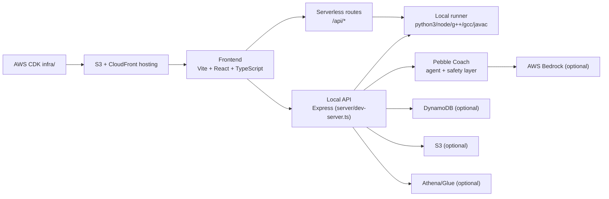

# PebbleCode

**Recovery-first coding practice with contextual AI mentor guidance.**

<p align="center">
  
</p>

PebbleCode is a recovery-first coding practice platform that combines an IDE-like session workflow, contextual AI mentoring, multilingual learning support, and measurable progression insights in one product surface.

Instead of optimizing only for accepted submissions, PebbleCode emphasizes the real learning loop: **run → diagnose → recover → rerun**.

<p>
  <a href="https://main.d2c2alvh2q833h.amplifyapp.com">Live Demo</a> ·
  <a href="#readme-sections">README Sections</a> ·
  <a href="#what-makes-pebblecode-different">Features</a> ·
  <a href="#tech-stack">Tech Stack</a> ·
  <a href="#aws-architecture">AWS Architecture</a> ·
  <a href="#local-setup">Local Setup</a>
</p>

## README Sections
- [What makes PebbleCode different](#what-makes-pebblecode-different)
- [Powered by AWS](#powered-by-aws)
- [Core product surfaces](#core-product-surfaces)
- [Tech stack](#tech-stack)
- [Local setup](#local-setup)
- [Environment variables (core)](#environment-variables-core)
- [AWS architecture](#aws-architecture)
- [Deployment notes](#deployment-notes)

## What makes PebbleCode different
- **Recovery-first loop**: learning quality is measured across failed runs, correction quality, and rerun outcomes.
- **Context-aware AI mentor**: hint, explain, and next-step guidance is grounded in the current run and code context.
- **Multilingual support**: learners can practice and navigate core product surfaces across multiple language modes.
- **Single workflow, not fragmented tools**: onboarding, problems, IDE session, coach, insights, and community live in one product flow.

## Powered by AWS
<table>
  <tr>
    <td align="center"><strong>AWS</strong></td>
    <td align="center"><strong>Amazon Bedrock</strong></td>
    <td align="center"><strong>AWS Lambda</strong></td>
  </tr>
  <tr>
    <td align="center">
      
    </td>
    <td align="center">
      <br/>
      Model-backed mentor and coaching pathways
    </td>
    <td align="center">
      <br/>
      Serverless execution and integration paths
    </td>
  </tr>
</table>

## Core product surfaces
- **Home + onboarding**: first-run orientation and placement-aligned setup.
- **Problems browser**: curated practice index with practical filtering and discovery controls.
- **Session IDE**: Monaco-based coding workspace with run/test feedback.
- **Pebble Coach**: contextual mentor guidance (hint/explain/next step).
- **Insights dashboard**: recovery, streak, and progression-oriented metrics.
- **Community prototype**: forum-style collaboration and learning discussion surface.

## Tech stack
- React
- TypeScript
- Vite
- Tailwind CSS
- Monaco Editor
- AWS Cognito
- Amazon API Gateway
- AWS Lambda
- Amazon DynamoDB
- Amazon S3
- Amazon Bedrock
- Optional advanced AWS integrations present in repo: Athena/Glue-based analytics paths

## Local setup
### Requirements
- Node.js 18+
- npm 9+
- Optional for full multi-language execution: `python3`, `node`, `g++`, `gcc`, `javac`, `java`

### Start locally
```bash
npm install
cp .env.example .env.local
npm run dev:full
```

Frontend: [http://localhost:5173](http://localhost:5173)  
Backend health: [http://localhost:3001/api/health](http://localhost:3001/api/health)

### Useful validation commands
```bash
npm run typecheck
npm run build
npm run smoke
npm run smoke:runner-modes
npm run self-check:language-pipeline
npm run test:function-mode
```

## Environment variables (core)
| Variable | Required | Purpose |
|---|---|---|
| `AWS_REGION` | Optional (required for many AWS-backed flows) | AWS SDK region |
| `FRONTEND_ORIGIN` | Recommended | Share/report links origin |
| `VITE_API_BASE_URL` | Recommended for Amplify/Vite static hosting | Absolute backend origin, e.g. `https://<api-id>.execute-api.<region>.amazonaws.com` |
| `VITE_COGNITO_USER_POOL_ID` | Auth | Cognito User Pool ID |
| `VITE_COGNITO_CLIENT_ID` | Auth | Cognito App Client ID |
| `COGNITO_USER_POOL_ID`, `COGNITO_CLIENT_ID` | Optional fallback | Non-`VITE_` frontend fallback keys |
| `PROFILES_TABLE_NAME` | Optional | Profiles table for backend/profile APIs |
| `AVATARS_BUCKET_NAME` | Optional | Persistent avatar uploads |
| `BEDROCK_MODEL_ID` | Optional | Coach model selection |
| `RUNNER_URL` | Optional | Remote runner endpoint |
| `RUNNER_LAMBDA_NAME` | Optional | Lambda-based runner target |

## AWS architecture
PebbleCode runs as a Vite React frontend with local/serverless API paths for session runner, coach, auth, and reporting workflows.



## Deployment notes
### CloudFront + S3
```bash
AWS_REGION=ap-south-1 AWS_PROFILE=<your-profile> STACK_NAME=PebbleHostingStack bash infra/scripts/deploy-frontend.sh
```

What this does:
1. Builds frontend (`npm ci && npm run build`)
2. Resolves S3 bucket + CloudFront distribution from stack outputs
3. Syncs `dist/` to S3 with cache headers
4. Creates CloudFront invalidation

### Amplify Hosting
If using Amplify for frontend hosting, set these env vars on the branch:
- `VITE_API_BASE_URL=https://<api-id>.execute-api.<region>.amazonaws.com`
- `VITE_COGNITO_USER_POOL_ID=<stack output UserPoolId>`
- `VITE_COGNITO_CLIENT_ID=<stack output UserPoolClientId>`

## Troubleshooting
- **“Cognito not configured”**: set `VITE_COGNITO_USER_POOL_ID` and `VITE_COGNITO_CLIENT_ID`, then restart/redeploy.
- **Run API failures**: ensure `npm run dev:full` is running; otherwise configure `RUNNER_URL` or `AWS_REGION + RUNNER_LAMBDA_NAME`.
- **Toolchain unavailable**: install missing executables (`python3`, `node`, `g++`, `gcc`, `javac`, `java`).
- **Bedrock errors**: verify AWS credentials, `AWS_REGION`, and `BEDROCK_MODEL_ID`.
- **Avatar persistence issues**: configure `AVATARS_BUCKET_NAME` and bucket CORS for your frontend origin.

## Credits
Built by **Addy (Aditya Singh)**.

## License
No explicit OSS license file is currently present in this repository.
