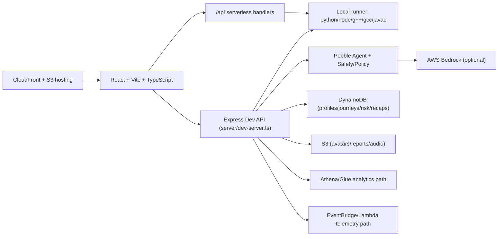

# PebbleCode

**Recovery-first coding practice with a real IDE, mentor guidance, and measurable progress loops.**

PebbleCode is built for one core outcome: help learners recover faster from mistakes.
Instead of rewarding only final acceptance, it captures the full cycle: **run → diagnose → fix → rerun**.

## Why PebbleCode

- **Recovery over rote AC:** tracks recovery time, autonomy, hint reliance, and error patterns.
- **Context-aware mentor:** Pebble Coach responds using live code + run/test context.
- **Real multi-language execution:** Python 3, JavaScript, C++17, Java 17, and C (GNU).
- **Track + flexibility:** placement sets your learning track, but editor language stays user-selectable.
- **Demo-ready + cloud-ready:** local-first workflow with optional AWS integrations.

## Judges Quickstart

### Requirements

- Node.js 18+
- npm 9+
- Local toolchains for runner smoke:
  - `python3`
  - `node`
  - `g++`
  - `gcc`
  - `javac` + `java` (JDK 17+)

### Fastest local run

```bash
npm install
npm run dev:full
```

Open [http://localhost:5173](http://localhost:5173)

### 3-minute click path

1. Home → **Try Pebble**
2. Complete onboarding + placement
3. Session IDE → switch language → **Run**
4. Open **Pebble Coach** (Hint/Explain/Next)
5. **Submit** and review testcase diagnostics
6. Dashboard/Insights → **Export Report**

## Demo Script (2–4 min)

1. **Problem framing (20s):** “Pebble optimizes recovery quality, not just accepted submissions.”
2. **Live IDE loop (60–90s):** run starter code, inspect failing tests, patch, rerun.
3. **Mentor assist (45–60s):** show tiered Coach response grounded in run output.
4. **Signals (30–45s):** open Insights (autonomy, streak, issue profile, next actions).
5. **Artifact (20–30s):** export one-page Recovery Report PDF.

## Feature Tour

### Session IDE + Runner

- Monaco-based editor with language switching.
- Multi-language runtime via `/api/run` + local runner.
- Supports both:
  - **Function mode** (curriculum units with signature checks/harness)
  - **Stdio mode** (problem-style stdin/stdout)
- Structured run statuses: compile/runtime/timeout/toolchain unavailable.

### Pebble Coach

- Right-panel mentor with tiered guidance (`T1/T2/T3`).
- Uses live unit context, run status, and failing summary.
- Safety/policy layer in server-side guardrail pipeline.

### Problems Browser + Learning Track

- LeetCode-style catalog with filters/tags/difficulty.
- SQL and code problem support from shared problem bank.
- Placement determines **learning track** (`languageFocus + level`) and pacing.
- Editor language remains independently selectable and persisted.

### Insights Dashboard

- KPI cards: recovery effectiveness, autonomy, guidance reliance, streak, breakpoints.
- Issue profile, radar, next actions, contribution heatmap, growth ledger.
- Live mental-state hook for realtime deltas.

### Notifications Center

- Header bell with unread state and category filters (All/Coach/Progress/System).
- Persists per user scope in localStorage.
- Wired to real product actions (sign-in, placement complete, profile updates, run/submit/report/share events).

### Auth + Profile

- Cognito-backed auth flows:
  - signup
  - email verification
  - login (email **or** username)
  - forgot password
- Premium profile page with:
  - avatar upload (S3 or local fallback)
  - display name + bio
  - username availability checks + cooldown-based change flow

### Export Recovery Report

- One-page PDF generated server-side.
- Includes user/session/problem metadata, KPI grid, error breakdown, summary bullets.
- Download filename includes sanitized user + problem + date.

## Architecture Overview



### Runtime modes

- **Local-first:** frontend + express dev API (`npm run dev:full`)
- **Runner remote mode:** supported via `RUNNER_URL` or Lambda runner env
- **AWS-enhanced mode:** optional Bedrock, DynamoDB, Athena, Polly, SageMaker integrations

## Tech Stack

| Layer | Stack |
|---|---|
| Frontend | React 19, TypeScript, Vite, Tailwind, Framer Motion, Monaco |
| Local backend | Express 5 + TypeScript |
| Serverless API | Vercel API routes (`/api`) |
| Runner | Python 3, Node, g++, gcc, javac/java |
| AI | AWS Bedrock Runtime |
| Data | DynamoDB, Athena, Glue |
| Files | S3 + presigned URL flows |
| Infra | AWS CDK v2 (hosting, backend, phase stacks, pipeline) |

## Setup

### Local Setup

1. Install dependencies:

```bash
npm install
```

2. Configure env:

```bash
cp .env.example .env.local
```

3. Run app + local backend:

```bash
npm run dev:full
```

4. Verify:

- Frontend: [http://localhost:5173](http://localhost:5173)
- Backend health: [http://localhost:3001/api/health](http://localhost:3001/api/health)

### Validation Commands

```bash
npm run typecheck
npm run build
npm run lint
npm run smoke
npm run smoke:runner-modes
npm run self-check:language-pipeline
npm run test:function-mode
```

### Environment Variables (Core)

Use `.env.local` (full comments in `.env.example`).

| Variable | Required | Purpose |
|---|---|---|
| `AWS_REGION` | Optional | AWS SDK region |
| `FRONTEND_ORIGIN` | Recommended | Share/report link origin |
| `VITE_COGNITO_USER_POOL_ID` | Auth | Cognito user pool id |
| `VITE_COGNITO_CLIENT_ID` | Auth | Cognito app client id |
| `COGNITO_USER_POOL_ID`, `COGNITO_CLIENT_ID` | Optional fallback | Non-`VITE_` auth fallback keys |
| `PROFILES_TABLE_NAME` | Optional | DynamoDB profile table |
| `AVATARS_BUCKET_NAME` | Optional | S3 avatar persistence |
| `BEDROCK_MODEL_ID` | Optional | Coach model id |
| `RUNNER_URL` | Optional | Remote runner endpoint |
| `RUNNER_LAMBDA_NAME` | Optional | Lambda runner function |

### AWS Setup (CDK)

```bash
cd infra
npm ci
npx cdk bootstrap aws://<ACCOUNT_ID>/<REGION>
npx cdk deploy --all
```

From repo root, deploy frontend assets:

```bash
bash infra/scripts/deploy-frontend.sh
```

## Deploy to AWS (CloudFront + S3)

This repo already includes deployment tooling:

- `infra/lib/hosting-stack.ts` (S3 + CloudFront)
- `infra/scripts/deploy-frontend.sh` (build + S3 sync + CloudFront invalidation)

Manual deploy command:

```bash
AWS_REGION=ap-south-1 AWS_PROFILE=<profile> STACK_NAME=PebbleHostingStack bash infra/scripts/deploy-frontend.sh
```

Optional CI/CD stack exists in `infra/lib/pipeline-stack.ts` (CodePipeline + CodeBuild), enabled when `codestarConnectionArn` context is provided.

## Project Structure

```text
.
├── src/
│   ├── pages/                 # Landing, onboarding, placement, session, problems, dashboard, profile, auth, legal
│   ├── components/            # home/session/layout/ui/auth/insights
│   ├── data/                  # problem bank, onboarding, placement data
│   ├── content/               # curriculum JSON paths by language
│   ├── lib/                   # auth, runner client, stores, analytics, mode/language helpers
│   └── providers/             # Auth, Theme, I18n
├── server/
│   ├── dev-server.ts          # local API surface
│   ├── runnerLocal.ts         # compile/run engine
│   ├── reports/               # report model + PDF renderer
│   ├── pebbleAgent/           # mentor orchestration
│   └── safety/                # policy/redaction/guardrails
├── api/                       # serverless handlers for Vercel-style runtime
├── shared/                    # shared language registry and ids
├── scripts/                   # smoke tests + pipeline self-checks
├── infra/                     # CDK stacks + deploy script
└── docs/                      # operational/debug docs
```

## Safety, Privacy, and Boundaries

- Safety/policy checks run before mentor output is returned.
- Lower-tier guidance is designed to avoid direct full-solution leakage.
- Auth/profile routes use bearer-token identity checks.
- Notification and preference storage are user-scoped in local storage.
- Telemetry and report pipelines are structured around session metadata.

## Troubleshooting

### 1) “Cognito not configured”

Set:

- `VITE_COGNITO_USER_POOL_ID`
- `VITE_COGNITO_CLIENT_ID`

Then restart/redeploy.

### 2) `/api/run` failures

- Local mode: ensure `npm run dev:full` is running.
- Remote mode: set `RUNNER_URL`, or set `AWS_REGION + RUNNER_LAMBDA_NAME`.
- See `docs/vercel-run-debug.md` for production triage.

### 3) Toolchain unavailable

Install and expose in PATH: `python3`, `node`, `g++`, `gcc`, `javac`, `java`.

### 4) Bedrock request failures

Verify `AWS_REGION`, `BEDROCK_MODEL_ID`, and credentials/IAM policy.

### 5) Avatar upload issues

Set `AVATARS_BUCKET_NAME` and configure S3 CORS for your frontend origin.

### 6) Browser polyfill auth issues

This app uses `vite-plugin-node-polyfills` for Cognito SRP compatibility.
If auth breaks after config changes, restart Vite and clear cache.

## Screenshots

No screenshot assets are currently committed under `docs/`.
For submission decks, add images in `docs/screenshots/` and reference them here.

Suggested captures:

1. Home hero + feature grid
2. Session IDE run failure + fix loop
3. Pebble Coach tiered response
4. Problems browser filters/table
5. Insights dashboard
6. Exported recovery PDF

## Roadmap / What’s Next

- Improve lint baseline and enforce stricter CI quality gates.
- Expand curated problem packs and richer hidden testcase coverage.
- Harden AWS “premium phase” flows for production reliability.
- Add deeper learner analytics and mentor personalization controls.

Historical roadmap context: [ROADMAP.md](./ROADMAP.md)

## Credits

Built by the PebbleCode team.

## License

No explicit OSS license file is currently present in this repository.
